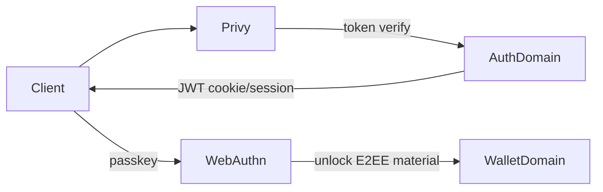
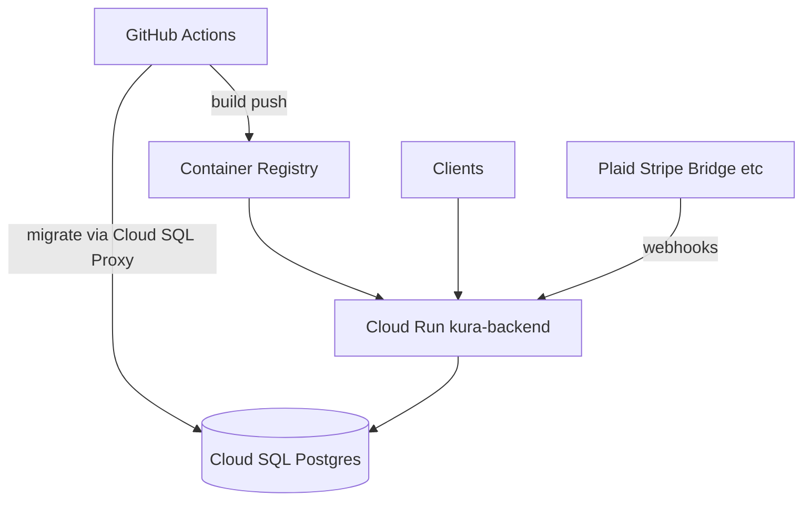

# Architecture

[繁體中文](ARCHITECTURE.zh-TW.md)

Kura backend is a domain-oriented Express API. Business logic lives under `src/domains/`; bootstrapping and HTTP wiring are in `src/index.ts` and `src/config/env.ts`.

## High-level layout

```
src/
  index.ts              # Express app, middleware, route mounts, well-known
  config/env.ts         # Env load, DATABASE_URL, validation
  domains/
    auth/               # Privy login, JWT session, passkeys, referrals, tier gate
    plaid/              # Bank link, webhooks, sync
    asset/              # Aggregated holdings
    exchange/           # CEX balances/trades (CCXT)
    debank/             # Crypto wallet positions
    wallet/             # Wallet / encrypted payload helpers
    treasury/           # Org Treasury Safes (Pro/Ultimate hard gate)
    bridge/             # Fiat on/off-ramp, KYC, webhooks
    dinari/             # Tokenized equities (dShares)
    stripe/             # Billing + webhooks
    notification/       # User notifications
    waitlist/           # Waitlist signup
    platform-insights/  # Internal revenue / volume insights
    privy-analytics/    # Privy usage analytics
    lifi-analytics/     # LI.FI integrator volume
    admin/              # Ops console: dashboard reads + Bridge funds-request returns
    email/              # Resend transactional mail
    logger/             # Winston logging
    shared/             # Prisma, rate limits, shared utils
    demo/               # Demo-user helpers (used by other domains)
prisma/
  schema.prisma
  migrations/           # Authoritative schema history
```

## Request pipeline

1. Env init (`initializeEnv`) builds `DATABASE_URL` and validates required secrets.
2. Raw-body handlers for Stripe and Bridge webhooks (signature verification).
3. CORS from `ALLOWED_ORIGINS` (required in production).
4. JSON body parser, cookies, HTTP logging.
5. Rate limiters on `/api/auth` and `/api/*`.
6. Web tier gate (`webTierGate`): Basic users may authenticate and upgrade; many web APIs require Pro / Ultimate.
7. Domain routers under `/api/...` (e.g. `/api/treasuries` uses `requirePaidTier` for all client types).

## Auth model



- **Privy** (`PRIVY_APP_ID`, `PRIVY_APP_SECRET`, `PRIVY_VERIFICATION_KEY`): primary identity provider.
- **App JWT** (`JWT_SECRET`): session issued by this API after Privy verification.
- **WebAuthn / Passkeys** (`WEBAUTHN_*`): unlock client-side E2EE data; RP ID must match the API hostname used by clients.
- **Tier / Stripe**: subscription tier gates sync quotas and web features.

## Integration boundaries

| Partner | Role | Domain |
|---------|------|--------|
| Plaid | US bank linking & transactions | `plaid` |
| DeBank | On-chain portfolio | `debank` |
| CCXT | Centralized exchange connectors | `exchange` |
| Bridge | On/off-ramp, KYC, virtual accounts | `bridge` |
| Dinari | Tokenized stocks | `dinari` |
| Stripe | Pro / Ultimate billing; `billing-status` re-syncs from Stripe | `stripe` |
| Treasury | Org multi-sig Safes (Pro/Ultimate only) | `treasury` |
| Resend | Transactional email | `email` |
| LI.FI | Cross-chain transfer analytics | `lifi-analytics` |
| Logo.dev | Asset logos (token) | shared utils |

Webhook signature verification is fail-closed for Bridge when `BRIDGE_WEBHOOK_PUBLIC_KEY` is unset.

## Data

- **PostgreSQL** via Prisma. Schema and migrations under `prisma/` are the source of truth.
- Production uses Cloud SQL (Unix socket path under `/cloudsql/...` when `NODE_ENV=production`).
- Sensitive user financial payloads may be encrypted client-side; server stores ciphertext where designed for E2EE. Do not assume all columns are plaintext PII-free—treat the DB as sensitive.

## Deployment topology (current)



Canonical deploy path: [`.github/workflows/deploy.yml`](../.github/workflows/deploy.yml) → Cloud Run. `cloudbuild.yaml` / `app.yaml` are legacy and not the primary path—see [OPERATIONS.md](OPERATIONS.md).
