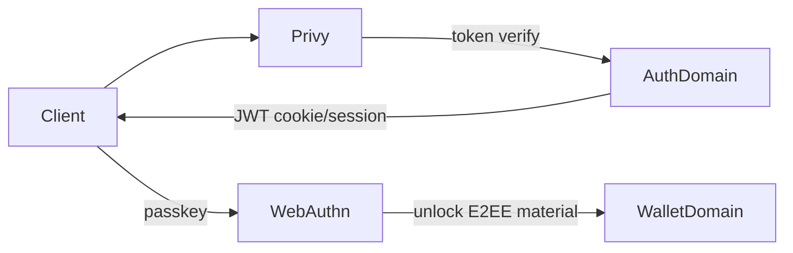
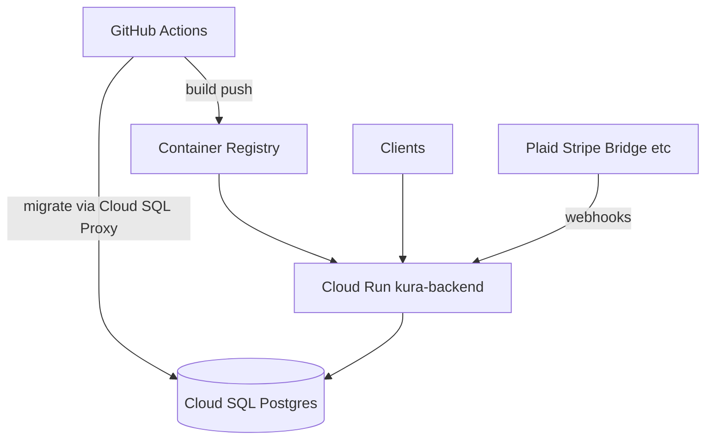

# 架構

[English](ARCHITECTURE.md)

Kura 後端為以網域劃分的 Express API。業務邏輯位於 `src/domains/`；啟動與 HTTP 接線在 `src/index.ts` 與 `src/config/env.ts`。

## 目錄結構概覽

```
src/
  index.ts              # Express app、中介層、路由掛載、well-known
  config/env.ts         # 環境變數載入、DATABASE_URL、驗證
  domains/
    auth/               # Privy 登入、JWT session、Passkey、推薦、方案閘道
    plaid/              # 銀行連結、webhook、同步
    asset/              # 彙總持倉
    exchange/           # CEX 餘額／交易（CCXT）
    debank/             # 鏈上錢包部位
    wallet/             # 錢包／加密 payload 輔助
    treasury/           # 組織 Treasury Safe（Pro／Ultimate 硬閘）
    bridge/             # 法幣出入金、KYC、webhook
    dinari/             # 代幣化股票（dShares）
    stripe/             # 計費 + webhook
    notification/       # 使用者通知
    waitlist/           # 候補報名
    platform-insights/  # 內部營收／量能洞察
    privy-analytics/    # Privy 使用分析
    lifi-analytics/     # LI.FI integrator 量能
    email/              # Resend 交易郵件
    logger/             # Winston 日誌
    shared/             # Prisma、速率限制、共用工具
    demo/               # Demo 使用者輔助（供其他網域使用）
prisma/
  schema.prisma
  migrations/           # 權威 schema 歷史
```

## 請求管線

1. 環境初始化（`initializeEnv`）建立 `DATABASE_URL` 並驗證必要密鑰。
2. Stripe／Bridge webhook 的 raw-body 處理（簽章驗證）。
3. CORS 來自 `ALLOWED_ORIGINS`（正式環境必填）。
4. JSON body parser、cookie、HTTP 日誌。
5. `/api/auth` 與 `/api/*` 速率限制。
6. Web 方案閘道（`webTierGate`）：Basic 可登入與升級；多數 Web API 需 Pro／Ultimate。
7. 各網域路由掛載於 `/api/...`（例如 `/api/treasuries` 另以 `requirePaidTier` 限制所有 client）。

## 認證模型



- **Privy**（`PRIVY_APP_ID`、`PRIVY_APP_SECRET`、`PRIVY_VERIFICATION_KEY`）：主要身分提供者。
- **App JWT**（`JWT_SECRET`）：Privy 驗證通過後由本 API 簽發 session。
- **WebAuthn／Passkeys**（`WEBAUTHN_*`）：解鎖客戶端 E2EE 資料；RP ID 須與客戶端使用的 API 主機名一致。
- **方案／Stripe**：訂閱等級控制同步額度與 Web 功能。

## 整合邊界

| 夥伴 | 角色 | 網域 |
|------|------|------|
| Plaid | 美國銀行連結與交易 | `plaid` |
| DeBank | 鏈上投資組合 | `debank` |
| CCXT | 中心化交易所連接 | `exchange` |
| Bridge | 出入金、KYC、虛擬帳戶 | `bridge` |
| Dinari | 代幣化股票 | `dinari` |
| Stripe | Pro／Ultimate 計費；`billing-status` 向 Stripe 重同步 | `stripe` |
| Treasury | 組織多簽 Safe（僅 Pro／Ultimate） | `treasury` |
| Resend | 交易郵件 | `email` |
| LI.FI | 跨鏈轉帳分析 | `lifi-analytics` |
| Logo.dev | 資產圖示（token） | shared utils |

未設定 `BRIDGE_WEBHOOK_PUBLIC_KEY` 時，Bridge webhook 簽章驗證採 fail-closed（拒絕全部事件）。

## 資料

- **PostgreSQL**（Prisma）。`prisma/` 下 schema 與 migrations 為唯一真相來源。
- 正式環境使用 Cloud SQL（`NODE_ENV=production` 時 Unix socket 路徑為 `/cloudsql/...`）。
- 敏感財務資料可能由客戶端加密；伺服器在 E2EE 設計下存放密文。勿假設所有欄位皆無個資——請將資料庫視為敏感資產。

## 部署拓樸（現況）



正式部署路徑：[`.github/workflows/deploy.yml`](../.github/workflows/deploy.yml) → Cloud Run。`cloudbuild.yaml`／`app.yaml` 為舊路徑，非主要流程——見 [OPERATIONS.zh-TW.md](OPERATIONS.zh-TW.md)。
